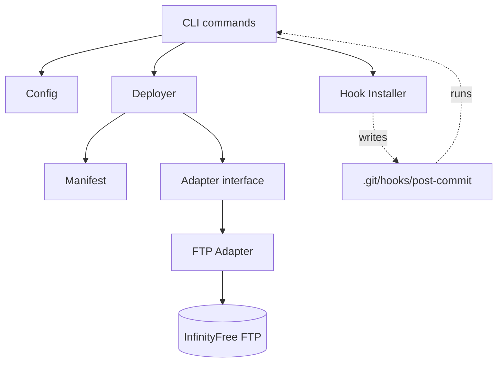
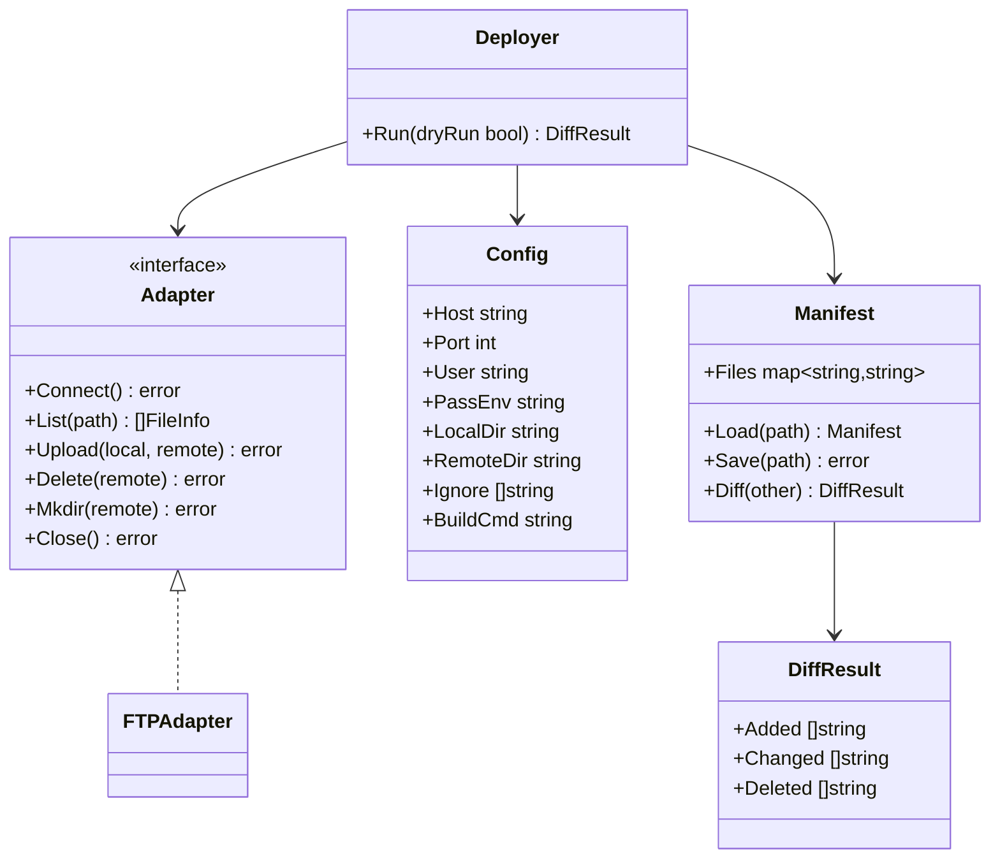
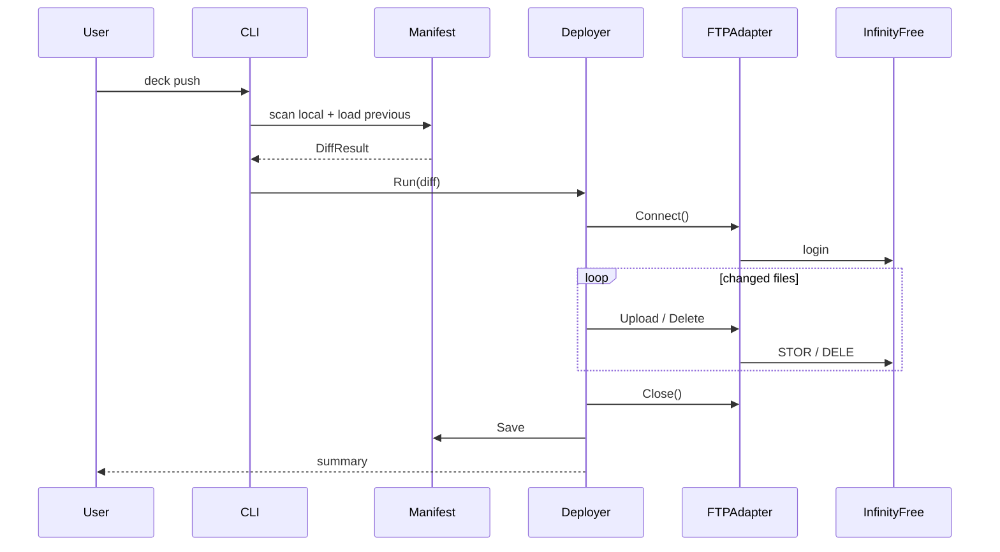
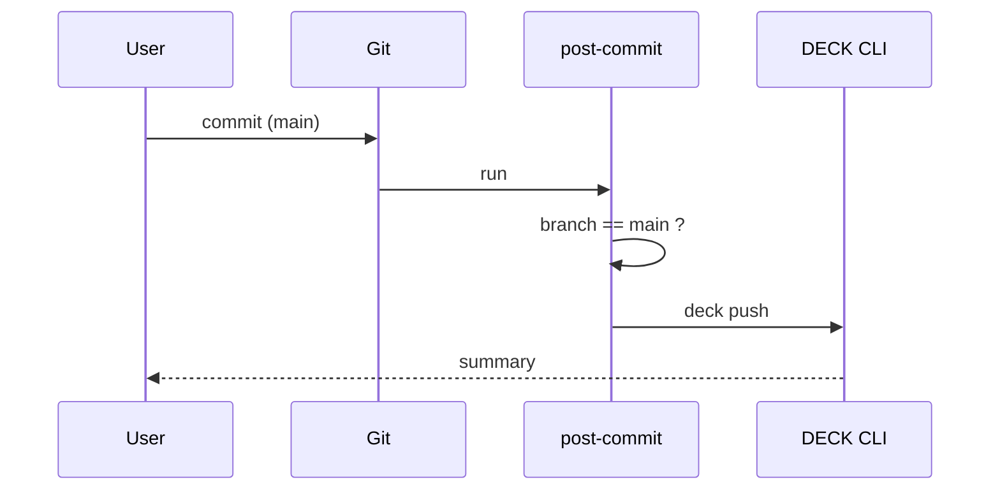

# DECK
## Deploy Every Commit, Kontinuous

## Scope

| In v1 | Out of v1 |
|---|---|
| FTP adapter | SFTP / other adapters |
| Manifest diffing | Multi-target config |
| `deck.yaml` config | GitHub Actions |
| Local git hook trigger | Webhook daemon |
| Styled CLI output | GUI |

## Components

## Types

## Flow — `deck push`

## Flow — auto trigger

## Commands

| Command | Effect |
|---|---|
| `deck init` | write `deck.yaml` |
| `deck diff` | dry run, no network |
| `deck push` | deploy diff |
| `deck status` | manifest vs config check |
| `deck install-hook` | wire `post-commit` on `main` |

## Roadmap (post-v1)

| Version | Adds |
|---|---|
| v2 | GitHub Actions target, secrets via env |
| v3 | SFTP / cPanel API adapters |
| v4 | Webhook daemon, multi-target config |
| v5 | GUI shell over same core |
